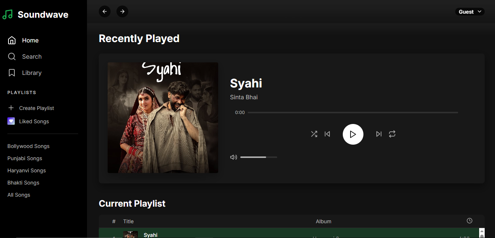

# 🎵 Modern MP3 Player

A beautifully designed, responsive music player built with **HTML**, **CSS**, and **JavaScript**. This modern MP3 player mimics the look and feel of popular streaming apps with features like playlist management, volume control, and media playback.



## 🚀 Features

- 🎧 Minimal and modern UI
- 🎨 Responsive layout with smooth animations
- 🏠 Sidebar with menu options (Home, Search, Library)
- 💾 Playlist section with categories and liked songs
- 🔂 Music controls (Play/Pause, Next, Previous, Shuffle, Repeat)
- 📊 Dynamic progress and volume bars
- 🎵 Recently played song display with album artwork

## 📁 Project Structure

📦 modern-mp3-player/ 
├── index.html 
├── styles.css 
├── script.js 
├── assets/
├── logo1.png│ ├── syahi.jpg│ 
└── preview.png


## 🛠️ Technologies Used

- **HTML5**
- **CSS3** (Custom styling + Google Fonts)
- **JavaScript** (DOM Manipulation, Audio API)
- **SVG Icons** (Feather icons for lightweight scalable graphics)

## 🖥️ How to Run Locally

1. Clone the repository:
   ```bash
   git clone https://github.com/yourusername/modern-mp3-player.git

2. Navigate to the project directory:

   **cd modern-mp3-player**

3. Open index.html in your browser.

💡 No server needed — it’s a fully static frontend project.

## 📌 To Do / Improvements

   1. Add support for uploading local audio files
   2. Visualizer animations
   3. Save liked songs with localStorage
   4. Add dark/light mode toggle
   5. Mobile menu toggle functionality

## 👨‍💻 Author
> Sumit – @Sumit1003  


